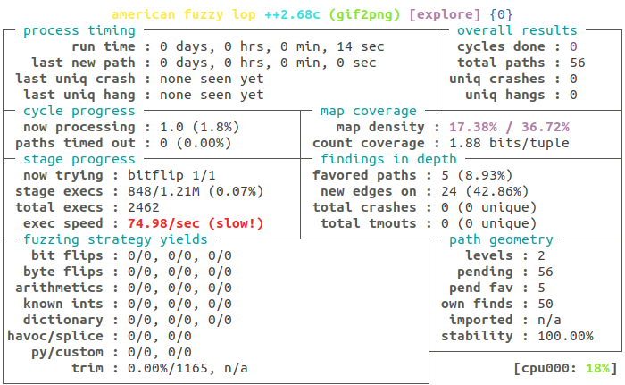

Homework 3: Fuzzy Bunnies
=========================

Overview
--------

Fuzzing is a technique for automatically testing software for the presence
of certain implementation bugs by supplying programs with malformed, unexpected,
or random data as input. Bugs are typically detected by monitoring the program
for runtime errors such as memory corruption (e.g., heap overflow, memory leaks),
undefined behavior (e.g., integer overflow), and assertion violations.

In this homework assignment, you will use `AFL++ <https://github.com/AFLplusplus/AFLplusplus>`_,
a variant of the popular `AFL <https://github.com/google/AFL>`_ fuzzing tool, to automatically
test C and C++ source code for certain security issues.

The learning goals of this homework assignment are as follows:

* To gain familiarity with Docker and a basic understanding of the concepts of
  containerization.
* To build a practical understanding of fuzzing and various strategies for
  optimizing its efficiency (i.e., time taken to find crashes) and
  effectiveness (i.e., its ability to detect bugs).

**Note:**
This homework will involve interacting with compilers, build systems, and
writing a small amount of C/C++ source code. We will not provide you with
complete instructions for all of the technical steps involved in the assignment.
In general, we consider the challenge of building, learning, and using new
software tools to be an essential part of the learning experience of this course.
(But if you do get stuck, reach out to one of the course staff via Slack,
email, or during office hours for assistance.)

Setup
-----

Docker
......

For this homework, you will use Docker, a popular containerization technology,
to safely and more easily interact with :code:`afl++`.
Containers are a lightweight alternative to Virtual Machines (VMs)
that perform virtualization at the OS-level rather than the hardware level
by having containers share the kernel of the host machine.

Like VMs, containers are provisioned from a provided image. We provide a
:code:`Dockerfile` that contains executable instructions for constructing
the Docker image for the homework. To build the image for the homework,
first `install Docker <https://docs.docker.com/get-docker/>`_ **(and if
you're using Linux, be sure to follow the post-install steps)**,
and then execute the following from the root of this directory:

.. code::

   $ docker build -t cmuqa/fuzzing:base .

Risks and Precautions
.....................

As fuzzing involves generating and executing a very large number of test
inputs, it consumes lots of CPU resources (although AFL is bound to a single
process), may potentially eat up all of your system's memory and fill
your storage drive with junk, and could lead to other unexpected events
as a result of executing arbitrary inputs.
For a more extensive discussion of risks, you should refer to the `AFL
documentation <https://afl-1.readthedocs.io/en/latest/limitations.html#risks>`_.

Running AFL inside a container is a great way to mitigate against these
risks. We can use the :code:`-m` option for :code:`docker run` to `enforce
hard memory limits inside the container <https://docs.docker.com/config/containers/resource_constraints/>`_.

Exercise
--------

This homework is split into three tasks.
The first two tasks are relatively simple and designed to introduce you to the
basic concepts of fuzzing and to build familiarity with some of the features of
AFL++.  In the final task, you will apply your knowledge to perform fuzz
testing on a real-world, open source C/C++ project of your choosing.

Task 1: Warming Up
------------------

**In this task, you will instrument, build, and fuzz an open-source command line
utility for converting GIFs to PNGs (gif2png-2.5.11).**

Setup
.....

Before beginning, make sure that you have built the :code:`cmuqa/fuzzing:aflplusplus` base Docker image.
Once that is in place, you should build the Docker image for this exercise:

.. code::

   $ cd exercises/1
   $ docker build -t cmuqa/fuzzing:exercise-one .

You should spin up a container for the exercise using the command below.
The :code:`-v` option is used to share the :code:`evidence`
directory between the container and host, which is used to store the
deliverables for the exercise.
The :code:`--user` option is only needed on Linux systems.
It avoids `potential permissions issues <https://vsupalov.com/docker-shared-permissions/>`_
when sharing files between the host and container due to differing uid/gids.

.. code::

   $ docker run \
         --rm \
         -v $(pwd)/evidence:/workspace/evidence \
         --user "$(id -u):$(id -g)" \
         -it cmuqa/fuzzing:exercise-one

Once inside the container, you should build the :code:`gif2png` binary
with *fuzzing instrumentation* by using :code:`afl-clang-lto` as your C compiler
(specified by the :code:`CC` environment variable),
as shown below. Instrumentation adds additional instructions to your
program at compile time that are used to guide the fuzzing process (e.g.,
edge coverage) without changing the semantics of the program.

.. code::

   (docker) $ cd gif2png
   (docker) $ CC=afl-clang-lto make gif2png

Before continuing any further, you should manually check that the program does
indeed convert GIFs to PNGs. You can do so by using one of the images in the
:code:`gif2png/Test` directory inside the container.

.. code::

   (docker) $ cd gif2png
   (docker) $ gif2png Test/ducks.gif

To be able to view the resulting PNG on the host machine, you should move the
output to the shared :code:`graphs` directory:

.. code::

   (docker) $ mv ducks.png graphs

An Introduction to Fuzzing via AFL
..................................

Now that you have built the program with fuzzing instrumentation and
confirmed that it works on a sample image, you are almost ready to
start fuzzing. Before you begin, you will need to create a *corpus*
of seed inputs. These are example files that are used as initial inputs
by the fuzzer. The fuzzer will subsequently mutate these inputs to
discover new inputs that lead the program to new paths, increase coverage,
and, possibly find crashing or hanging bugs in your program.

You should create a new directory for these seed inputs, before finding some
example GIF files and adding them to that directory. For now, let's use
the GIF files that are provided with gif2png's test suite.

.. code::

   (docker) $ mkdir /workspace/inputs
   (docker) $ cp /workspace/gif2png/test/*.gif /workspace/inputs

Once you have an input corpus in place, you can begin fuzzing the program
via :code:`afl-fuzz`, as shown below. :code:`-i` option specifies the
directory that provides the input corpus.

.. code::

   (docker) $ cd /workspace
   (docker) $ afl-fuzz -i inputs -o output gif2png/gif2png

Below is a brief description of the command-line options for :code:`afl-fuzz`.
For more, you should check out :code:`afl-fuzz -hh`.

* :code:`-i` specifies a directory of seed inputs or test cases.
* :code:`-o` specifies where the fuzzer's findings should be written.
* :code:`-m` specifies memory limit for child processes.
* :code:`-t msec` specifies the timeout for each run in milliseconds.
* :code:`-V` can be used to place a time limit on the fuzzing process
  (in seconds).

If all goes well, you should see something that looks like the image below.
Note that, if you encounter an error (e.g., :code:`PROGRAM ABORT : Pipe at the beginning of 'core_pattern'`),
you should see the Troubleshooting section at the end of this document. If your
problem isn't described there, you should post your issue to Piazza.

A detailed explanation of the information displayed on the status screen can be
found in the
`AFL documentation <https://github.com/mirrorer/afl/blob/master/docs/status_screen.txt>`_.
For now, we are most interested in the following bits of information:

* :code:`total execs`: number of test inputs that have been generated and executed.
* :code:`exec speed`: number of test inputs that finish executing each second.
* :code:`total paths`: number of generated test inputs that have led new to
  execution patterns (i.e., inputs that have increased coverage).
* :code:`uniq crashes`: number of unique crashes that have been encountered
  when testing generated inputs. As soon as this counter is greater than
  zero, we have found a test input that reveals a potential bug in our
  program.

The Importance of a Good Input Corpus
.....................................

As you can see in the image above, a warning is being displayed about the
:code:`exec speed`. For fuzzing to be effective, we want this number to be
as high as possible. The current number, :code:`74.98/sec` is bad! This
suggests that our input corpus isn't very good. At a rate of
74.98 execs per second, it might take us a while to discover a crashing
input.

**For the remainder of the task, you should figure out how to modify the
input corpus to increase exec speed and find a crashing input.
(Tip: maybe the AFL performance tips are useful? [https://afl-1.readthedocs.io/en/latest/tips.html].)
Depending
on your hardware, it should take less than 30 seconds to find a crashing
input when a good input corpus is used.**

Once you are done, you should compare the performance of the fuzzer with
your new input corpus vs. the original input corpus by running the fuzzer
for a set period of time (e.g., 5 minutes) using the :code:`-V` option
(i.e., `-V 5)`. You will be required to submit performance data from
each of these fuzzer runs to `exercises/1/evidence <exercises/1/evidence>`_
in this homework repository.

Deliverable: Evidence
.....................

For both the baseline and improved input corpus, you should:

* Copy :code:`fuzzer_stats`, :code:`fuzzer_setup`, :code:`plot_data`, and
  :code:`crashes` from :code:`output` to the appropriate evidence directory
  for that configuration
  (i.e., :code:`/workspace/evidence/baseline` or :code:`/workspace/evidence/improved`).
* Run :code:`afl-plot` on the :code:`output` directory to produce performance
  graphs for the run. To save those graphs to the appropriate location in
  the corresponding evidence directory, you can execute the following:

  .. code::

      (docker) $ afl-plot /workspace/output /workspace/evidence/baseline

* Finally, between each run, you should either use a new :code:`output`
  directory or destroy the existing one to avoid information being used
  between runs.

Note that the information inside the :code:`/workspace/evidence` directory will
automatically be shared with the host (thanks to the :code:`-v` command we used to create
the Docker container). You should remember to commit the contents of this
directory to your homework repository.

Task 2: The Tortoise and The Hare: Accelerating Fuzzing
-------------------------------------------------------

**In this task, you will use AFL to efficiently find a known vulnerability in
an older version of LibXML2, a well-known XML parsing library.** In the
previous task, you were able to simply apply AFL to an instrumented binary
(i.e., :code:`gif2png`) with relatively little engineering effort.
For this task, you will be required to fuzz a library that doesn't provide you
with a binary that you can simply fuzz out of the box.

Setup
.....

As in the previous task, we provide a Docker image for the exercise that
is built via:

.. code::

   $ cd exercises/2
   $ docker build -t cmuqa/fuzzing:exercise-two .

You should read the `Dockerfile <exercises/2/Dockerfile>`_ used for this
exercise to understand how we build LibXML2 with fuzzing instrumentation.Note that we compile LibXML2 with `Address Sanitizer (ASAN) <https://clang.llvm.org/docs/AddressSanitizer.html>`_ enabled.
Note that we compile LibXML2 with `Address Sanitizer (ASAN) <https://clang.llvm.org/docs/AddressSanitizer.html>`_
enabled. Sanitizers are used to instrument your program with error detection
code. ASAN is used to quickly detect memory corruption errors (e.g., stack overflow)
and cause the program to immediately crash. There are other sanitizers (e.g.,
`UBSan <https://clang.llvm.org/docs/UndefinedBehaviorSanitizer.html>`_) that
you can use to detect more bug classes during fuzzing (e.g., integer overflow).
The trade-off with using sanitizers is that they add additional execution time
overhead to your program. For example, ASAN and UBSAN add 2X and 1.2X overhead,
respectively. In general, you should consider which sanitizers are appropriate
for your application based on the types of errors that you suspect to find.

Once you have finished looking at the Dockerfile, you should use :code:`docker
run` to spin up the container:

.. code::

   $ cd exercises/2
   $ docker run \
      --rm \
      -v $(pwd)/evidence:/workspace/evidence \
      --user "$(id -u):$(id -g)" \
      -it cmuqa/fuzzing:exercise-two

Before continuing, you should ensure that the test suite behaves as expected on
your machine by by executing the following command and checking its output.
In the event that you get a different output, you should reach out to one of
the course staff with your error message and details of your machine.

.. code::

   (docker) $ ./testModule
   Success!

Writing a test harness
......................

Since we are fuzzing an API rather than a binary, we need to write a custom
fuzzing test harness that forwards randomly generated inputs from the command
line to the specific part of API that we want to test. Even in cases where we
have a binary, this approach is preferable as it much more targeted and therefore
faster.

To make the task easier, we have included a template for writing a fuzzing test
harness in :code:`harness.c`. You should complete this template by writing code
that uses the LibXML2 library to attempt to parse a given XML file. You should
finish writing :code:`harness.`c` on your host machine and not inside the
container.
(Hint: you should see whether there is any code that you can reuse and repurpose
from the `LibXML2 code examples <http://www.xmlsoft.org/examples/index.html>`_.)

Once you have finished writing a test harness, you will need to rebuild the
Docker image for the exercise:

.. code::

   $ cd exercises/2
   $ docker build -t cmuqa/fuzzing:exercise-two .

Fuzzing the API via the test harness
....................................

Now that you have a fuzzing test harness, you can begin fuzzing the program.
For this exercise, you will als owant to enforce specific memory limits on AFL
itself using the :code:`-m` option for :code:`afl-fuzz`.

To be successful in your fuzzing attempts, you will need to carefully
construct an input corpus.  You should also consider using a `fuzzer dictionary
<https://afl-1.readthedocs.io/en/latest/fuzzing.html#fuzzer-dictionaries>`_ to
improve the efficiency and effectiveness of the fuzzer.

However, even with an excellent corpus and the use of a fuzzer dictionary,
you may it take you a while to discover a crashing input due to a relatively
low exec speed. Each time a new input is tried by AFL, the fuzzer will fork
a new process for that input. You can avoid the overhead of forking and increase
the efficiency of fuzzing by 10X with the use of `persistent mode <http://lcamtuf.blogspot.com/2015/06/new-in-afl-persistent-mode.html>`_.
This approach allows test inputs to be generated and executed within a
single-process loop. To enable persistent fuzzing, you will need to make minor
changes to your test harness (and rebuild your Docker image).

Deliverables
............

For this task, you should try to systematically optimize your fuzzing
configuration to the best of your ability (i.e.,, corpus selection, fuzzer
dictionary, persistent fuzzing). If optimized correctly, you should be able to
find a crashing input with roughly thirty minutes to one hour of fuzzing
effort.

Your optimized input corpus should be submitted as part of your GitHub
homework repository.

You the same submit artifacts for your fuzzing configuration as in the
previous task (i.e., :code:`fuzzer_stats`, :code:`fuzzer_setup`,
:code:`plot_data`, :code:`crashes`, and the outputs from :code:`afl-plot`)
to the :code:`evidence` directory for the task.

Task 3: Fuzzing for fun -- and maybe for profit, too?
-----------------------------------------------------

**In this task, you will apply your knowledge from the previous tasks to fuzz
an open-source project of your choice.**

To begin with, you should find a single *fuzz target* (e.g., binary or API to fuzz)
in an appropriate open-source C/C++ project (e.g., image processing, document parsers, math libraries).
You should consider what makes for a good fuzzing target;
`Google provide a great starting place as part of their documentation
for their own fuzzing tools <https://github.com/google/fuzzing/blob/master/docs/good-fuzz-target.md>`_.

Once you have found a good fuzz target, you should try to fuzz that target
as efficiently and effectively as possible. Note that we do not expect you to
find potential vulnerabilities in your fuzz target. In practice, successful
fuzzing campaigns can sometimes span days, weeks, or even months! With that
said, if you do manage to find one, we will be impressed :-)
Instead, you should aim to fuzz your target as exhaustively as possible
in a reasonable window of time (e.g., a few hours of execution).

You should build on what you learned in the previous exercises to make
fuzzing as fast and effective as possible. `AFL's documentation provides
some excellent tips to get you started <https://afl-1.readthedocs.io/en/latest/tips.html>`_.
We do not expect you to implement every possible optimization (at a certain
point, you'll start to see diminishing returns), but we do expect that
you will attempt some.

Deliverable: Dockerfile
.......................

You should include a :code:`Dockerfile` for your project in the
:code:`exercises/3` directory of the :code:`main` branch of your
GitHub repository.

* Your :code:`Dockerfile` should build an all-in-one image for fuzzing your
  selected target.  It should build both the project (with appropriate
  instrumentation) and any accompanying fuzzing harnesses.
* You should extend the base Docker image provided in this homework
  by using :code:`FROM cmuqa/fuzzing:base` at the top of your :code:`Dockerfile`.
* You should include your input corpus and any custom dictionaries.

Deliverable: Evidence
.....................

You should include the same set of artifacts as the previous tasks (i.e.,
:code:`fuzzer_stats`, :code:`fuzzer_setup`, :code:`plot_data`, :code:`crashes`,
and the outputs from :code:`afl-plot`) to the :code:`evidence` directory for
the task.

Deliverable: Report
...................

You should use Gradescope to submit a single PDF, roughly three pages long
(soft limit), that describes your efforts. We leave the content of the report
intentionally unspecified to allow you to report the outcomes of this task as
you best see fit. At a minimum, you should cover the following:

* What project and target did you select for fuzzing? Why did you pick them?
* How did you go about fuzzing the target?

  * What optimizations did you employ?
  * How did you choose those optimizations?
  * What corpus did you use?
  * Did you write a harness?

* What challenges did you face?
* How extensively were you able to fuzz the target?

As part of your report, you should include graphs produced by afl-plot.

Bonus Tips
..........

* Is there an existing dictionary that you can use to generate inputs? If not,
  is it possible to write one?
* Is there already a good input corpus for your domain on GitHub?
* Consider what sanitizers you will use for fuzzing based on the kinds
  of errors that are likely to occur in the particular project that you are
  studying. If you are unsure, ASAN and UBSAN are a good choice.
* Each fuzzing session runs on a single core. To better use multiple cores,
  you might consider using the :code:`afl-fuzz-parallel` script provided in the
  container image.
* To learn more about how AFL actually works under the hood, check out the
  `"whitepaper" <https://github.com/mirrorer/afl/blob/master/docs/technical_details.txt>`_.
* GitHub Security Lab also has some excellent resources on fuzzing:

  * https://securitylab.github.com/research/fuzzing-challenges-solutions-1
  * https://securitylab.github.com/research/fuzzing-software-2

Grading
-------

There are a total of 100 points for this homework, which are split as follows:

* **Task 1:** 20 points

  * We expect you to provide fuzzing artifacts for the :code:`baseline` and
    :code:`improved` configurations.

* **Task 2:** 30 points

  * We expect you to write a test harness for fuzzing LibXML2, submit your
    optimized input corpus, and provide fuzzing artifacts for your optimized
    configuration. Submissions will be scored on the basis of optimizations
    (i.e., persistent fuzzing, input corpus, fuzzer dictionaries), and whether
    or not a crashing input is discovered.

* **Task 3:** 50 points

  * We expect you to provide a custom :code:`Dockerfile` for your chosen project
    that builds on top of the base image. That image should include your test
    harness, input corpus, and any custom dictionaries.
  * We expect you to provide artifacts from fuzzing your selected target.
  * We expect you to write a report, described above, that details your efforts.

Troubleshooting
---------------

PROGRAM_ABORT: Pipe at the beginning of `core_pattern`
......................................................

If you experience the following problem on Linux:

.. code::

   [*] Checking core_pattern...

   [-] Hmm, your system is configured to send core dump notifications to an
       external utility. This will cause issues: there will be an extended delay
       between stumbling upon a crash and having this information relayed to the
       fuzzer via the standard waitpid() API.
       If you're just testing, set 'AFL_I_DONT_CARE_ABOUT_MISSING_CRASHES=1'.

       To avoid having crashes misinterpreted as timeouts, please log in as root
       and temporarily modify /proc/sys/kernel/core_pattern, like so:

       echo core >/proc/sys/kernel/core_pattern

   [-] PROGRAM ABORT : Pipe at the beginning of 'core_pattern'
            Location : check_crash_handling(), src/afl-fuzz-init.c:1934

You should temporarily update your core pattern as :code:`root` via:

.. code::

   $ sudo su
   # echo core >/proc/sys/kernel/core_pattern

If you don't have :code:`sudo` access (or would, understandably, prefer not to
use it), you can set the following environment variable:
